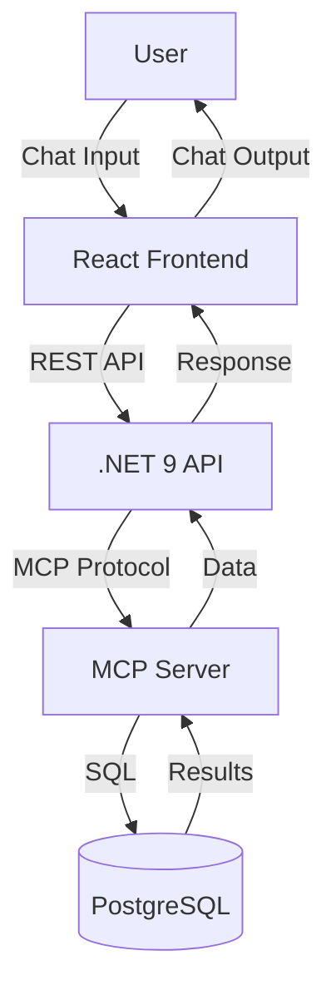

# BS Quiz Chatbot

> A full-stack chatbot application inspired by ChatGPT, answering user queries using information from a PostgreSQL database via the MCP server. The backend is built in .NET 9, the frontend in React, and the MCP server acts as a secure bridge to the database.

---

## Architecture Overview



---

## Prerequisites

- Node.js v18+
- .NET 9 SDK
- PostgreSQL (local or remote)
- MCP server ([repo](https://github.com/executeautomation/mcp-database-server))

---

## 1. PostgreSQL Database Setup

1. Install PostgreSQL and create a database (e.g., `brain_squeeze_db`).
2. Create a user with privileges:
   ```sql
   CREATE USER <username_here> WITH PASSWORD <your_password>;
   CREATE DATABASE brain_squeeze_db OWNER <username_here>;
   GRANT ALL PRIVILEGES ON DATABASE brain_squeeze_db TO <username_here>;
   ```
3. (Optional) Use provided migrations to create tables:
   - Run from backend folder:
     ```powershell
     dotnet ef database update
     ```

---

## 2. MCP Server Setup

1. Clone and install MCP server:
   ```powershell
   git clone https://github.com/executeautomation/mcp-database-server
   cd mcp-database-server
   npm install
   ```
2. Start MCP server for PostgreSQL:
   ```powershell
   npx @executeautomation/database-server --postgresql --host localhost --database brain_squeeze_db --user username_here --password password_here
   ```
3. MCP exposes a protocol endpoint for the backend to connect.

---

## 3. Backend (.NET 9) Setup

1. Configure `BSchatbot/appsettings.json`:
   ```json
   {
     "ConnectionStrings": {
       "MessagesDatabase": "Host=localhost;Database=brain_squeeze_db;Username=username_here;Password=password_here"
     },
     "ApiKey": {
       "KimiKey": "your_kimi_key",
       "GeminiKey": "your_gemini_key",
       "DeepSeekKey": "your_deepseek_key",
       "OpenAiKey": "your_openai_key"
     }
   }
   ```
2. Ensure `McpService.cs` uses correct MCP connection arguments.
3. Restore and build:
   ```powershell
   cd BSchatbot
   dotnet restore
   dotnet build
   dotnet run
   ```
4. API runs at `https://localhost:7127` (default).

---

## 4. Frontend (React + Vite) Setup

1. Configure API endpoint in frontend if needed (default: `https://localhost:7127`).
2. Install dependencies:
   ```powershell
   cd BSchatbotFrontend/bsFrontend
   npm install
   ```
3. Start development server:
   ```powershell
   npm run dev
   ```
4. Open [http://localhost:5173](http://localhost:5173).

---

## 5. Authentication & Usage

- Register and login via the frontend (`/register`, `/login` pages).
- Auth is handled via ASP.NET Identity and cookies/sessions.
- Only authenticated users can chat and view conversation history.

---

## 6. Developer Workflow

- **Database migrations:**
  - Add new models or fields in backend, then run:
    ```powershell
    dotnet ef migrations add MigrationName
    dotnet ef database update
    ```
- **API Endpoints:**
  - `POST /api/chat` — send chat prompt, get streamed response
  - `GET /api/chat/conversations` — fetch user conversation history
  - `POST /api/chat/addConversation` — start new conversation
- **MCP Tool Calls:**
  - Backend uses MCP tools for SQL queries, table management, and insights
- **Frontend:**
  - Uses React hooks for state, fetches API with credentials for auth
  - Markdown rendering for chat output

---

## 7. Troubleshooting

- **MCP server not connecting:**
  - Check MCP server logs and arguments
  - Ensure PostgreSQL is running and credentials are correct
- **Backend errors:**
  - Check `appsettings.json` for correct connection strings and API keys
  - Use `dotnet run` output for error details
- **Frontend issues:**
  - Check browser console for CORS/auth errors
  - Ensure API endpoint matches backend URL
- **Database migrations:**
  - If schema changes, re-run migrations and restart MCP server

---

## Key Decisions & Tradeoffs

- **MCP server** decouples database logic, improves security, but adds deployment complexity
- **PostgreSQL** chosen for reliability and open-source support
- **.NET 9** backend for modern C# features and robust API/auth
- **React** frontend for SPA experience and rapid development
- **Authentication** via ASP.NET Identity for secure user management

---

## Advanced: Docker & Deployment

- Containerize MCP, backend, and frontend for production
- Use environment variables for secrets
- Set up CI/CD for automated builds, tests, and deployments

---

## References
- [MCP Server Documentation](https://github.com/executeautomation/mcp-database-server)
- [React](https://react.dev/)
- [.NET](https://dotnet.microsoft.com/)
- [PostgreSQL](https://www.postgresql.org/)
