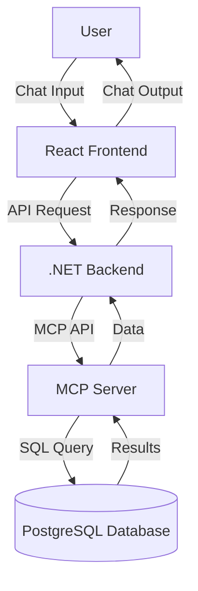

# BS Quiz Chatbot

A full-stack chatbot application inspired by ChatGPT, designed to answer user queries using information stored in a PostgreSQL database. The backend leverages the MCP server (https://github.com/executeautomation/mcp-database-server) for secure and efficient database access, while the frontend is built with React for a modern user experience.

---

## Architecture Overview



---

## How to Run the Application

### Prerequisites
- Node.js (v18+ recommended)
- .NET 9 SDK
- PostgreSQL database
- MCP server (https://github.com/executeautomation/mcp-database-server)

### 1. Set Up the MCP Server
1. Clone and follow setup instructions at [MCP Server GitHub](https://github.com/executeautomation/mcp-database-server).
2. Configure MCP to connect to your PostgreSQL instance.
3. Start the MCP server and note its API endpoint.

### 2. Configure and Run the Backend (.NET)
1. Update `BSchatbot/appsettings.json` and `appsettings.Development.json` with your MCP server endpoint and any required secrets.
2. From the `BSchatbot` directory, run:
   ```powershell
   dotnet restore
   dotnet build
   dotnet run
   ```
3. The backend should start and listen for API requests from the frontend.

### 3. Run the Frontend (React)
1. Navigate to `BSchatbotFrontend/bsFrontend`.
2. Install dependencies:
   ```powershell
   npm install
   ```
3. Start the development server:
   ```powershell
   npm run dev
   ```
4. Access the app at [http://localhost:5173](http://localhost:5173) (default Vite port).

---

## Key Decisions & Tradeoffs

- **MCP Server Integration:**
  - Chosen for secure, scalable, and language-agnostic database access.
  - Decouples database logic from backend, improving maintainability.
- **PostgreSQL Database:**
  - Reliable, open-source, and well-supported for structured data.
- **.NET Backend:**
  - Provides robust API layer, authentication, and business logic.
  - Easy integration with MCP and modern C# features.
- **React Frontend:**
  - Delivers responsive, SPA experience for users.
  - Enables rapid UI development and easy state management.
- **Tradeoffs:**
  - MCP server adds an extra layer, increasing deployment complexity but improving security and scalability.
  - Using multiple technologies (.NET, React, MCP, PostgreSQL) requires more setup but allows for best-in-class solutions for each layer.

---

## Professional Developer Notes

- **Environment Variables:**
  - Store secrets and connection strings outside source code (use `.env` for frontend, environment variables for backend).
- **Database Migrations:**
  - Use Entity Framework migrations for backend schema changes.
- **Testing:**
  - Backend: xUnit or NUnit recommended.
  - Frontend: Jest and React Testing Library.
- **Deployment:**
  - Containerize with Docker for production.
  - Use CI/CD for automated builds and tests.

---

## Troubleshooting
- Ensure MCP server is running and accessible from backend.
- Check API endpoints and ports in config files.
- Use browser dev tools and backend logs for debugging.

---

## License
MIT

---

## References
- [MCP Server Documentation](https://github.com/executeautomation/mcp-database-server)
- [React](https://react.dev/)
- [.NET](https://dotnet.microsoft.com/)
- [PostgreSQL](https://www.postgresql.org/)
